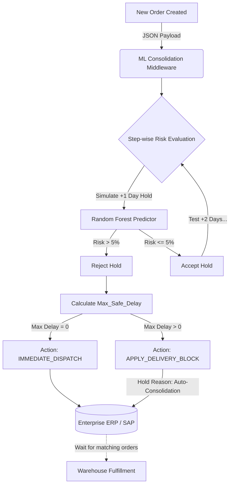

# 📦 B2B Smart Logistics: ML-Driven Order Consolidation Optimizer

## 📖 Business Context & Problem Statement
In B2B logistics, consolidating multiple orders from customers into a single shipment can drastically reduce freight costs. 
Historically in global B2B operations (outside of high-density regions like China), consolidation opportunities are often overlooked. 
Deliveries strictly adhere to the customer's required delivery date, resulting in inefficient Less-than-Container Load (LCL) shipments and wasted truck capacity. 
*(Note: In regions like China, operations inherently utilize more LCL setups due to decentralized logistics and vast delivery requirements).*

However, artificially delaying an order to wait for a potential consolidation opportunity increases the risk of **Late Delivery Complaints**, potentially damaging critical business relationships and breaching Service Level Agreements (SLAs).

This project tackles this trade-off by utilizing Machine Learning to quantify delivery risks and optimize consolidation strategies, transitioning from a manual, intuition-based approach to a data-driven framework.

---

## 🗂️ Project Structure
* **`01_Data_Generation`**: Generates synthetic B2B order and logistics data for model simulation.
* **`02_EDA_and_Feature_Engineering`**: Handles geospatial mapping and models contractual "gray areas".
* **`03_modelling`**: Trains, tunes, and evaluates the ML predictive engine.
* **`04_Create_Customer_Profile`**: Batch script to generate automated offline risk profiles for the Customer Service (CS) team.

---

## 📊 Data Architecture
The synthetic data generated in `01_Data_Generation` simulates real-world B2B logistics pipelines. The dataset comprises 5,000 records with the following schema:

| Feature | Data Type | Description |
| :--- | :--- | :--- |
| `Order_ID` | `string` | SAP Delivery Order Number|
| `Customer_ID` | `string` | SAP Customer Number |
| `Order_Date` | `datetime` | SAP SO creation date |
| `Required_Delivery_Date` | `datetime` | SAP Customer Required delivery date |
| `Actual_Delivery_Date` | `datetime` | 3rd party database, actual delivery date |
| `Delay_Days` | `int64` | calculation, Actual_Delivery_Date - Required_Delivery_Date |
| `Shipping_Cost` | `float64` | SAP freight PO POH actual cost (linked via shipment order then delivery order) |
| `Contract_Grace_Period_Days`| `int64` | Contractually allowed delay period without formal breach. |
| `Warehouse_Location` | `string` | Origin regional warehouse. |
| `Distance_to_Warehouse_km` | `float64` | Haversine distance from warehouse to customer. |
| `Is_Complained` | `float64` | **Target Variable:** `1` if customer complained, `0` otherwise. |
| `Complaint_Reason` | `string` | Reason for complaint (if applicable, null otherwise). |

---

## 🎯 Part 1: Current Implementation - Customer Profiling & ML Optimization

### The Core Idea
The current implementation identifies clients who are less sensitive to delivery delays, generating a dynamic list of low-risk customers. This allows the Customer Service (CS) team to manually consolidate orders with confidence, prioritizing efficiency without sacrificing client satisfaction.

### 🧠 Methodology & Key Features

1. **B2B Contractual "Gray Area" Modeling (`02_EDA`):**
   Unlike standard B2C scenarios, B2B contracts often include allowed grace periods (e.g., 3 to 7 days). This project specifically models the "Gray Area"—where a delivery is legally compliant within the grace period but may still trigger customer dissatisfaction and informal complaints.
2. **Geospatial Feature Engineering (`02_EDA`):**
   Utilizes the Haversine formula to map customer coordinates to the nearest regional warehouses. This directly correlates physical distance to delivery variance, lead times, and shipping costs.
3. **Machine Learning Predictive Engine (`03_modelling`):**
   Trains a `RandomForestClassifier` (optimized via `GridSearchCV`) to predict the probability of a complaint based on order features (`Distance_to_Warehouse`, `Delay_Days`, `Contract_Grace_Period_Days`, etc.).
4. **Automated Offline Profiling (`04_Create_Customer_Profile`):**
   A batch script processes historical data to calculate a `Tolerance_Score` for each client. It outputs a comprehensive dashboard-ready dataset detailing the `Base_Max_Safe_Delay_Days` per customer, empowering CS to execute manual consolidations backed by ML confidence.

### 📈 Key Findings
By identifying the true risk thresholds of different customer segments, the model demonstrates that allowing a strictly controlled micro-risk (e.g., `< 5%` complaint probability) unlocks a significant volume of orders eligible for consolidation. This leads to substantial freight cost savings without breaching SLAs or damaging relationships.

---

## 🚀 Part 2: Future Roadmap - Real-Time Inference API

While the offline profiling provides immediate ROI, it still relies on manual intervention. The ultimate vision is to eliminate manual touchpoints through deep ERP system integration.

### The Vision: ERP-Safe "Soft Hold" Architecture
The business uses SAP (specifically `VL06O` reports containing goods ready date, required delivery date, customer, and ship-from location) to control deliveries.

* **Stage 1 (Semi-Automated):** Logistics downloads the `VL06O` report, runs it through the ML pipeline, and the model suggests consolidatable orders. Shipments are then created manually based on the script's output.
* **Stage 2 (Fully Automated):** API integration automates shipment creation directly within the ERP.

### How It Will Work (Stage 2):
1. **Step-wise Risk Simulation:** The API evaluates incoming orders on a scheduled SAP batch job. It simulates holding the order for +1, +2, or +3 days, checking the predicted complaint risk at each interval.
2. **Real-time Order Evaluation:**
   - **Safe Hold:** If a delay is safe (Risk < 5%), the API returns a `Max_Safe_Delay` and instructs SAP to apply a temporary `DELIVERY_BLOCK`. This block leverages SAP's native MRP logic to auto-bundle the order with subsequent orders from the same client. Once the timer expires, the block drops, and the consolidated shipment dispatches.
   - **Unsafe Hold:** If no delay is safe, it returns `IMMEDIATE_DISPATCH`, suggesting individual delivery.

### 🏗️ Proposed System Architecture

